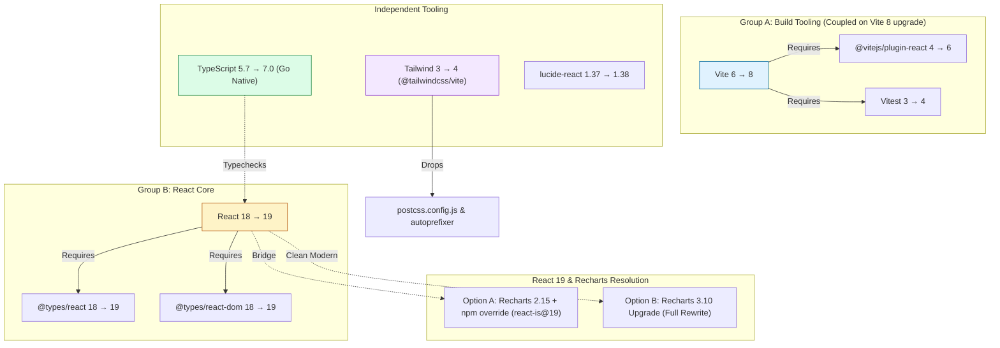

# Dependency Migration Plan — Reference Document

A comprehensive analysis of every outdated dependency, their upgrade paths, inter-dependencies,
effort, value, security implications, and recommended sequencing. **For reference only — no changes implemented.**

---

## Executive Summary & ROI Matrix

| Phase | Target Packages | Dev Effort | Build/CI Speedup | Risk | Value / ROI | Recommendation |
| :--- | :--- | :--- | :--- | :--- | :--- | :--- |
| **Phase 0** | `lucide-react` (1.37 → 1.38) | ⬜ 5 min | Neutral | None | ⬜ Low | ✅ Do anytime |
| **Phase 1** | `vite` 8 + `@vitejs/plugin-react` 6 + `vitest` 4 | 🟡 1-2h | ⚡ **3–5x faster build** (Rolldown/Oxc) | Low | 🟢🟢 **Very High** | ✅ **Prioritize (Step 1)** |
| **Phase 2** | `typescript` 7 + `@types/node` 24 | 🟡 1-2h | ⚡ **8–12x faster `tsc -b`** (Go engine) | Low-Med | 🟢🟢 **Very High** | ✅ **Prioritize (Step 2)** |
| **Phase 3** | `react` 19 + `@types/react(dom)` 19 | 🟡 2-3h | Improved runtime reconciliation | Medium | 🟢 High | ✅ Follow Phase 1 & 2 |
| **Phase 4** | `tailwindcss` 4 + `@tailwindcss/vite` | 🟠 2-4h | Lightning CSS in Rust, drops 2 configs | Medium | 🟢 High | 🟡 Do after build tools |
| **Phase 5** | `recharts` (2.15 → 3.10) | 🔴 4-6h | Tree-shaking & native React 19 hooks | High | 🟡 Medium | ⏸️ Optional / evaluate with Phase 3 |

**Total estimated effort:** ~6–11 hours for complete modern stack (Phases 0–4).

---

## Current State (Aug 2026)

| Package | Pinned | Installed | Latest | Gap | Category |
|---|---|---|---|---|---|
| `react` | ^18.3.1 | 18.3.1 | **19.2.8** | 1 major | UI Runtime |
| `react-dom` | ^18.3.1 | 18.3.1 | **19.2.8** | 1 major | UI Runtime |
| `recharts` | ^2.15.0 | 2.15.4 | **3.10.1** | 1 major | Data Visualization |
| `lucide-react` | ^1.16.0 | 1.37.0 | **1.38.0** | 1 minor | Icons |
| `tailwindcss` | ^3.4.17 | 3.4.19 | **4.3.3** | 1 major | CSS Framework |
| `vite` | ^6.1.0 | 6.4.3 | **8.2.2** | 2 major | Build Tool / Bundler |
| `vitest` | ^3.0.5 | 3.2.7 | **4.1.11** | 1 major | Test Runner |
| `typescript` | ~5.7.2 | 5.7.3 | **7.0.2** | 2 major | Compiler / Typecheck |
| `@vitejs/plugin-react` | ^4.3.4 | 4.7.0 | **6.1.1** | 2 major | Build Plugin |
| `@types/node` | ^22.13.0 | 22.20.1 | **26.4.0** | 4 major | Type Definitions |
| `@types/react` | ^18.3.18 | 18.3.31 | **19.2.18** | 1 major | Type Definitions |
| `@types/react-dom` | ^18.3.5 | 18.3.7 | **19.2.5** | 1 major | Type Definitions |
| `clsx` | ^2.1.1 | 2.1.1 | ✅ current | — | Utility |
| `tailwind-merge` | ^3.0.1 | 3.0.1 | ✅ current | — | Utility (Tailwind 4 ready) |
| `autoprefixer` | ^10.4.20 | 10.4.20 | ✅ current | — | Replaced in TW4 |
| `postcss` | ^8.5.1 | 8.5.1 | ✅ current | — | Replaced in TW4 |

**Runtime Environment:** Node.js `v24.15.0` (exceeds all package requirements).

---

## Dependency Coupling & Constraint Graph



### Coupling Rules
1. **Hard Directional Constraint**: Upgrading `vite` to 8 **requires** `@vitejs/plugin-react` 6 (Babel replaced with Oxc) and `vitest` 4. They must be committed together.
2. **Type Coupling**: `@types/react` 19 and `@types/react-dom` 19 must match React 19.
3. **Recharts 2 / React 19 Compatibility**: Recharts 2.x relies on `react-is` element checks. React 19 changes internal element symbols, leading to **blank charts** unless an `overrides` entry is added to `package.json` (`"react-is": "^19.0.0"`). Recharts 3 natively supports React 19.

---

## Best Practices & Rollback Strategy

To avoid breaking work in progress:
1. **Branching**: Execute each phase on its own branch (e.g. `chore/upgrade-vite-8`, `chore/upgrade-ts-7`).
2. **Lockfile Discipline**: Always commit `package-lock.json` alongside `package.json` for deterministic CI builds.
3. **Pre-Flight Audit**: Run `npm audit` and `npm test` before starting any phase.
4. **Immediate Rollback**: If a phase encounters unresolvable issues:
   ```bash
   git reset --hard HEAD
   npm ci
   ```
5. **Two-Tier Verification**: Perform automated verification (`npm test`, `npx tsc -b`, `npm run build`) AND manual visual smoke tests before merging each branch.

---

## Phase-by-Phase Migration Analysis

### Phase 0: Safe Minor Bump (`lucide-react`)

| Attribute | Detail |
|---|---|
| **Packages** | `lucide-react` 1.37.0 → 1.38.0 |
| **Effort** | ⬜ 5 minutes |
| **Value** | ⬜ Icon fixes and minor additions |
| **Risk** | 🟢 Zero (backward-compatible) |

**Commands:**
```bash
npm update lucide-react
```

**Verification:**
* **Automated**: `npm test && npm run build`

---

### Phase 1: Build Tooling Stack (Vite 8 + Vitest 4 + Plugin React 6)

> [!IMPORTANT]
> Vite 8 replaces Rollup and esbuild with **Rolldown** (Rust-based bundler). `@vitejs/plugin-react` 6 switches Fast Refresh transforms to **Oxc** (Rust-based). This combination delivers a 3–5x build speedup.

| Attribute | Detail |
|---|---|
| **Packages** | `vite` ^8.2.2, `vitest` ^4.1.11, `@vitejs/plugin-react` ^6.1.1 |
| **Effort** | 🟡 1–2 hours |
| **Value** | 🟢🟢 Very High — Faster local dev server, rapid production builds, unified Rust toolchain |
| **Risk** | 🟢 Low for standard SPAs |

**Breaking Changes & Project Impact:**
* **Node.js**: Minimum Node 20.19+ / 22.12+. (Current project uses Node 24.15.0 ✅).
* **Rollup Options**: `build.rollupOptions` is mapped to Rolldown with near 100% compatibility.
* **Proxy Configuration**: The API proxies in [vite.config.ts](file:///e:/Projects/property_buying_model/vite.config.ts) for `/api/yahoo` and `/api/fx` remain fully standard.
* **Vitest 4**: `maxThreads` renamed to `maxWorkers` (project does not customize thread pools, uses defaults ✅).

**Commands:**
```bash
git checkout -b chore/upgrade-vite-8
npm install vite@^8.2.2 vitest@^4.1.11 @vitejs/plugin-react@^6.1.1 --save-dev
```

**Verification Plan:**
1. **Automated**:
   ```bash
   npm test
   npm run build
   ```
2. **Manual Smoke Test**:
   * Run `npm run dev` and open `http://localhost:3000`.
   * Check Network tab: Verify Yahoo Finance stock price fetch and Frankfurter FX rate fetch resolve via Vite proxy.
   * Run `npm run preview` to verify production assets and base path (`/ireland-property-model/`).

---

### Phase 2: TypeScript 7.0 (Go-Native Engine "Corsa")

> [!TIP]
> TypeScript 7 is a full rewrite of the compiler in **Go**, offering **8x–12x faster typechecking**. `tsc -b` on this project will execute in under 150ms.

| Attribute | Detail |
|---|---|
| **Packages** | `typescript` ^7.0.2, `@types/node` ^24.0.0 |
| **Effort** | 🟡 1–2 hours (resolving strict inference improvements) |
| **Value** | 🟢🟢 Very High — Sub-second type-checking in IDE and CI pipelines |
| **Risk** | 🟡 Low-Medium (stricter type narrowing may surface latent bugs) |

**Key Considerations for [tsconfig.json](file:///e:/Projects/property_buying_model/tsconfig.json):**
* `target: "ES2020"` and `strict: true` are fully standard ✅.
* `moduleResolution: "bundler"` remains supported (or `"bundler16"` in TS 7.1+).
* **Ambient Types Gotcha**: TS 6/7 changes the default `types` search behavior. If `process` or Node globals show type errors in config files, add `"types": ["node"]` into `tsconfig.json`.

**Commands:**
```bash
git checkout -b chore/upgrade-typescript-7
npm install typescript@^7.0.2 @types/node@^24.0.0 --save-dev
```

**Verification Plan:**
1. **Automated**:
   ```bash
   npx tsc -b
   npm test
   npm run build
   ```
2. **Codebase Inspection**: Verify engine math types in `src/engine/types.ts` continue to infer without explicit `any` casts.

---

### Phase 3: React 19 Runtime Migration

| Attribute | Detail |
|---|---|
| **Packages** | `react` ^19.2.8, `react-dom` ^19.2.8, `@types/react` ^19.2.18, `@types/react-dom` ^19.2.5 |
| **Effort** | 🟡 2–3 hours |
| **Value** | 🟢 High — Modern React primitives, ref-as-prop, improved reconciliation |
| **Risk** | 🟡 Medium (Recharts 2 requires `overrides` bridge OR simultaneous Recharts 3 upgrade) |

**Codebase Readiness Audit:**
* **`useRef()` Initial Values**: Audited all 4 `useRef` instances in the codebase:
  - [`App.tsx`](file:///e:/Projects/property_buying_model/src/App.tsx#L41): `useRef<HTMLDivElement>(null)`
  - [`InfoTooltip.tsx`](file:///e:/Projects/property_buying_model/src/components/InfoTooltip.tsx#L22): `useRef<HTMLDivElement>(null)` (x2)
  - [`Navbar.tsx`](file:///e:/Projects/property_buying_model/src/components/Navbar.tsx#L42): `useRef<HTMLInputElement>(null)`
  All already pass explicit `null` ✅ — zero ref code changes needed.
* **`forwardRef`**: None used in the project ✅.
* **`ReactDOM.render`**: Project already uses `createRoot` from `react-dom/client` ✅.
* **JSX Runtime**: `tsconfig.json` already specifies `"jsx": "react-jsx"` ✅.

#### Implementation Paths for Recharts Compatibility:

##### 🟢 Path A: Bridge Approach (Recommended for quick React 19 upgrade)
Keep Recharts 2.15.4 and set the `react-is` override to resolve React 19 peer constraints and prevent blank charts:

```bash
git checkout -b chore/upgrade-react-19
# 1. Set override in package.json to prevent peer conflict & blank chart rendering
npm pkg set overrides.react-is="^19.0.0"

# 2. Install React 19 & type definitions
npm install react@^19.2.8 react-dom@^19.2.8
npm install @types/react@^19.2.18 @types/react-dom@^19.2.5 --save-dev
```

##### 🔵 Path B: Full Modernization (Combine Phase 3 + Phase 5)
Upgrade React 19 and Recharts 3 simultaneously. See Phase 5 for chart refactoring steps.

**Verification Plan:**
1. **Automated**: `npx tsc -b && npm test && npm run build`
2. **Manual Smoke Test**:
   * Open Projection Chart: Confirm chart renders lines, areas, grid, and tooltips (ensuring `react-is` is resolving properly and charts are NOT blank).
   * Open Mortgage Studio: Confirm overpayment amortization curves and milestone markers display.
   * Verify Sidebar interactive inputs (sliders, salary inputs, lump sum modifiers).

---

### Phase 4: Tailwind CSS 4 (CSS-First Architecture)

> [!NOTE]
> Tailwind CSS 4 is powered by **Lightning CSS** (Rust). It eliminates `tailwind.config.js`, `postcss.config.js`, and `autoprefixer`, drastically reducing project configuration complexity.

| Attribute | Detail |
|---|---|
| **Packages** | `tailwindcss` ^4.3.3, `@tailwindcss/vite` ^4.3.3 |
| **Packages Removed** | `autoprefixer`, `postcss`, `postcss.config.js`, `tailwind.config.js` |
| **Effort** | 🟠 2–4 hours |
| **Value** | 🟢 High — 20+ transitive dependencies removed, native CSS variables, instant HMR |
| **Risk** | 🟡 Medium (Utility renames & default color/border changes) |

**Key Architectural Changes:**

1. **Vite Plugin Integration**:
   In [vite.config.ts](file:///e:/Projects/property_buying_model/vite.config.ts):
   ```ts
   import { defineConfig } from 'vite';
   import react from '@vitejs/plugin-react';
   import tailwindcss from '@tailwindcss/vite';

   export default defineConfig({
     plugins: [tailwindcss(), react()],
     // ...
   });
   ```

2. **CSS-First Theme ([src/index.css](file:///e:/Projects/property_buying_model/src/index.css))**:
   Replace `@tailwind base; @tailwind components; @tailwind utilities;` with:
   ```css
   @import "tailwindcss";

   @custom-variant dark (&:where(.dark, .dark *));

   @theme {
     --color-brand-50: #f0f9ff;
     --color-brand-100: #e0f2fe;
     --color-brand-200: #bae6fd;
     --color-brand-300: #7dd3fc;
     --color-brand-400: #38bdf8;
     --color-brand-500: #0ea5e9;
     --color-brand-600: #0284c7;
     --color-brand-700: #0369a1;
     --color-brand-800: #075985;
     --color-brand-900: #0c4a6e;
     --color-brand-950: #082f49;

     --color-slate-850: #151f32;
     --color-slate-925: #0b1120;

     --font-sans: 'Inter', system-ui, -apple-system, BlinkMacSystemFont, 'Segoe UI', Roboto, sans-serif;
     --font-mono: 'JetBrains Mono', 'Fira Code', monospace;
   }

   @layer base {
     body {
       @apply bg-slate-950 text-slate-100 font-sans;
     }
   }
   ```

3. **Utility Renames to Inspect**:
   * `bg-gradient-to-*` → `bg-linear-to-*`
   * `shadow-sm` → `shadow-xs`, `shadow` → `shadow-sm`
   * `rounded-sm` → `rounded-xs`, `rounded` → `rounded-sm`
   * Default border color is now `currentColor` (explicitly use `border-slate-800` where needed).

**Commands:**
```bash
git checkout -b chore/upgrade-tailwind-4
npm install tailwindcss@^4.3.3 @tailwindcss/vite@^4.3.3 --save-dev
npm uninstall autoprefixer postcss
rm postcss.config.js tailwind.config.js
```
*(Optional: Run `npx @tailwindcss/upgrade@^4.0.0` to automatically scan and convert class names).*

> [!NOTE]
> Per project guidelines (§6), migrating from JavaScript-based `tailwind.config.js` to CSS-first `@theme` variables is an architectural styling shift. Record a lightweight ADR in `docs/adr/` (e.g. `docs/adr/0002-tailwind-4-css-theme-architecture.md`) when executing this phase.

**Verification Plan:**
1. **Automated**: `npm run build && npm test`
2. **Visual Smoke Test**:
   * Verify dark theme background (`bg-slate-950`, `bg-slate-900`, `bg-slate-850`).
   * Verify Brand blue accent highlights on buttons, active tabs, and sliders.
   * Verify custom scrollbar styling in `src/index.css`.
   * Check responsive layout on desktop and mobile viewports.

---

### Phase 5: Recharts 3 Migration (Optional / Future Refactor)

| Attribute | Detail |
|---|---|
| **Packages** | `recharts` ^3.10.1 |
| **Effort** | 🔴 4–6 hours (component rewrite across 2 large files) |
| **Value** | 🟡 Medium — Cleaner React 19 architecture, better tree-shaking |
| **Risk** | 🔴 High — Requires manual verification of all chart scales, axes, tooltips, and legends |

**Scope of Changes:**
* [ProjectionChart.tsx](file:///e:/Projects/property_buying_model/src/components/ProjectionChart.tsx) (280 lines): Wealth trajectory simulation charts, net worth vs property value curves.
* [MortgageStudioWidget.tsx](file:///e:/Projects/property_buying_model/src/components/MortgageStudioWidget.tsx) (907 lines): Amortization breakdown curves, overpayment comparison charts.

**Commands:**
```bash
git checkout -b chore/upgrade-recharts-3
npm install recharts@^3.10.1
# Remove "overrides": { "react-is": ... } if previously added
```

**Verification Plan:**
1. **Automated**: `npx tsc -b && npm test && npm run build`
2. **Visual Smoke Test**:
   * Multi-series ComposedChart synchronization.
   * Tooltip currency formatters (`€450k`, `€1.20M`).
   * Reference lines for deposit milestone and purchase timing.
   * Interactive chart toggle buttons (Rent Drag, Asset Buckets).

---

## Recommended Execution Sequence

```mermaid
gantt
    title Recommended Phasing Workflow
    dateFormat X
    axisFormat Step %s

    section Fast Tooling ROI
    Phase 0: Lucide patch             :milestone, p0, 0, 1
    Phase 1: Vite 8 + Vitest 4 Stack  :active, p1, 1, 3
    Phase 2: TypeScript 7 Go Engine   :p2, 3, 5

    section UI Modernization
    Phase 3: React 19 (Bridge Path A) :p3, 5, 8
    Phase 4: Tailwind 4 CSS-First     :p4, 8, 12

    section Deep Refactor (Optional)
    Phase 5: Recharts 3 Modernization :p5, 12, 17
```

---

## Why Did AI Pick These Versions Originally?

### 1. Training Cutoffs vs. Release Timelines
When this codebase was initially generated, the versions selected were the **latest stable and battle-tested industry standards**:
* **React 18.3**: React 19 was finalized in late December 2024. Most enterprise boilerplates and training corpora stabilized on 18.3.
* **Vite 6**: Vite 6 was the premier stable bundler throughout 2024/2025.
* **Tailwind 3.4**: Tailwind 4 released in late January 2025.
* **TypeScript 5.7**: TypeScript 6/7 released across 2025/2026.

The AI made **deliberate, robust choices** prioritizing stability, maximum ecosystem package compatibility, and zero-configuration setups.

### 2. Will Upgrading Hurt AI-Assisted Development?

> [!NOTE]
> **No — in fact, remaining on older versions will soon degrade AI effectiveness.**

* **LLM Knowledge Evolution**: Modern LLMs are trained on newer web codebases. As models update, they default to modern idioms (e.g. `ref` as standard prop without `forwardRef`, `@import "tailwindcss"` with CSS theme variables, Rolldown configs).
* **Fewer Deprecation Hallucinations**: Older patterns (e.g. `defaultProps` on function components, `ReactDOM.render`, `postcss.config.js`) are flagged by newer linters. Upgrading aligns the codebase with what current AI generates naturally.
* **The Only Exception (Recharts 3)**: Recharts 3 introduced structural syntax adjustments. Because LLMs have vast training data on Recharts 2 JSX syntax, you may occasionally see AI suggest Recharts 2 idioms when working on charts. This is why keeping Recharts 2 with the bridge override (Path A) is a pragmatic developer choice for now.

---

## Post-Migration Definition of Done Checklist

When executing any phase, ensure:
- [ ] `npm audit` reveals 0 high/critical vulnerabilities.
- [ ] `npx tsc -b` completes with 0 type errors.
- [ ] `npm test` runs all unit tests in `tests/` with 100% pass rate.
- [ ] `npm run build` generates production bundle in `dist/` without warnings.
- [ ] `npm run preview` confirms routing, asset paths, and dark styling work on `/ireland-property-model/`.
- [ ] `package-lock.json` is updated and committed alongside `package.json`.
